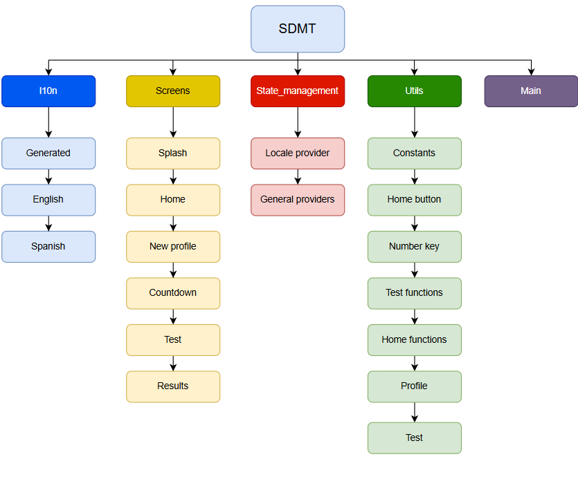
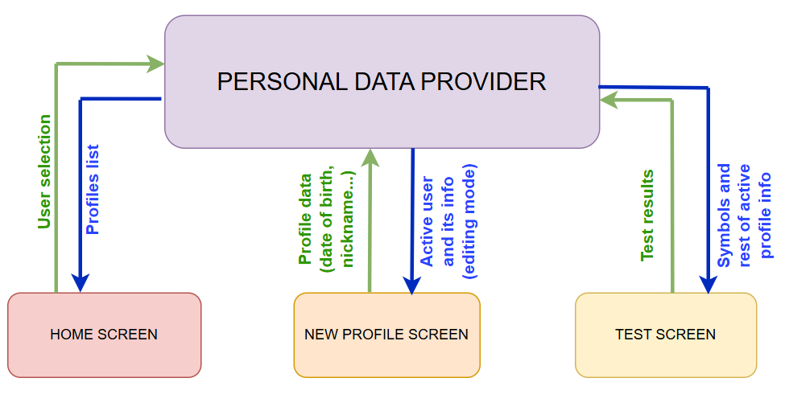

# SDMT - Symbol Digit Modalities Test

## What is the Symbol Digit Modalities Test (SDMT)?

The Symbol Digit Modalities Test (SDMT) is a standarized and widely used cognitive assesment, which primarily measures information processing speed but also involves other cognitive function. The test consists on a simple substitution task, based on a reference key like the one shown below:


There are two sets of symbols available: the user can select either of them when creating a profile, based on the instructions from its neurologist.

During the test, a symbol appears in the middle of the screen. The user has to find that symbol in the reference key, and press the number corresponding to that symbol. Once the user selects a number, regardless if it is the correct one or not, a new symbol appears. This goes on until the time is consumed. The test measures the symbols displayed, number of errors, average time to select a number, and other metrics that help assess cognitive function.

This test is used for different applications, like measuring cognitive deterioration in patients with degenerative diseases such as multiple sclerosis, identifying early signs of dementia and Huntington's disease or differentiating brain-damaged from psychotic patients.

## Project Structure

### Project Directory Structure
The project follows a Feature-First directory organization:

```
lib/
|   +--- l10n/                      # Localization system used for multilenguage
|   |   +---generated/              # Dart code that manages multilenguage
|   |   +---app_en.arb              # ARB file with all the text used in the app in English
|   |   +---app_es.arb              # ARB file with all the text used in the app in Spanish
|   +---screens/                    # Contains one file for every screen 
|   |   +---countdownScreen.dart    
|   |   +---homeScreen.dart         
|   |   +---newProfileScreen.dart
|   |   +---resultsScreen.dart
|   |   +---splashScreen.dart
|   |   +---testScreen.dart
|   +---state_management/           # Contains files for managing the communication between different widgets in the app (state management)
|   |   +--locale_provider.dart     # Only for the multilenguage feature
|   |   +--providers.dart           # All the providers used for state management
|   +---utils/                      # Utilities
|   |   +--constants.dart           # Constants used to parametrize numeric values in the app
|   |   +--HomeButton.dart          # Class created for the buttons in the home screen
|   |   +--numberKey.dart           # Class created for the numeric keyboard in the test screen
|   |   +--testFunctions.dart       # Contains the functions that handle the logic in the test screen
|   |   +--homeFunctions.dart       # Contains the functinos that handle the logic in the home and new profile screen
|   |   +--test.dart                # Class created to save internally information from the tests
|   |   +--profile.dart             # Class created to handle the data of the users profiles
|   +---main.dart
```

The main aspects of the organization of the code are the following:
- Following the Feature-First structure, the code is organized by functionality (features) instead of by the type of file. 
- The code is not organized following pure Clean Architecture, but most of the logic is separated from the UI in different files.
- Most of the numeric variables, especially the ones repeated throughout the code, are parametrized in constants to ease the UI modification.

### Features Overview



#### 1. l10n
Handles the implementation of multilenguage (English/Spanish) in the app
- **Generated**: Dart files generated by Flutter which handle the logic to display the texts in the language selected
- **app_en.arb**: ARB (Application Resource Bundle) file that contains all the texts displayed in the app. They are basically .json files with the texts in English and their keys that identify each of them.
- **app_es.arb**: ARB (Application Resource Bundle) file that contains all the texts displayed in the app. They are basically .json files with the texts in Spanish and their keys that identify each of them. 

#### 2. Screens
Contains one file for every screen displayed in the app. Each screen is a class itself, most of them extending stateless widget except countdown that is a stateful widget given the simplicity of its state management.
- **Splash**: Screen displayed while the app is launching, includes the app version and logos.
- **Home**: The main and first screen that appears in the app. The user can view the test results or start a new test.
- **New profile**: Create a new profile or edit or delete an existing one.
- **Countdown**: Displays a 3,2,1 countdown before starting the test.
- **Test**: The test is attempted in this screen.
- **Results**: After finishing the test, this screen displays a message to indicate if the results have been registered correctly.

#### 3. State Management
The state management feature handles the information shared by many different widgets in the app. The method used in this app for state management is the use of providers.
- **Locale provider**: Contains the provider used only to handle the multilenguage feature.
- **Providers**: Contains the rest of the providers, used for different functions (Symbols, Progress, Keyboard, Time, Parameters, Personal Data, Buttons, Device).

#### 4. Utils
Contains different utilities, implemented throughout the app for different purposes.
- **Constants**: A file containing all the constants, most of them but not all numeric constants, that are used in the app. This way of parametrizing allows for a quick and easy modification of UI and functionality. The constants are organized in four classes: TestConstants, NewProfileConstants and HomeConstants contain all the constants used to create the UI in the test, new profile and home screens, respectively. GeneralConstants contains all the rest of constants.
- **Home Button**: The HomeButton class is created to standardize the buttons displayed in the home screen, so that all of them have the same look, and to make the code of said screen more legible: the class receives as parameters the text it contains, the function that should be triggered when is pressed, a boolean that determines if the button should be active or locked, and the height the button should have.
- **Number key**: The same way as the HomeButton class, NumberKey is used to create the keys in the numeric keyboard in the test screen. Receives the number of that key and its height as arguments.
- **Test functions**: This file hosts all the functions that handle the logic and functionality of the test screen, like checking when a key has been pressed or what to do once the test is finished.
- **Home functions**: All the functions that handle the logic and functionality of both the home screen and the new profile screen.
- **Test**: Instances of this class are created to save internally data from the completed tests so that it can be displayed in the "view my tests" area. The saved paramters are date, hand, displayed symbols and mistakes.
- **Profile**: This class contains all the necessary information for the profiles created: nickname, sex, level of studies, date of birth, list of completed tests, and set of symbols used.

### State Management
As indicated before, this app uses providers to handle the information sharing between classes and widgets. All of these are stateless widgets, with the exception of the countdown screen: given its simplicity (it does not need to communicate with other classes), its logic is handled with initState. It receives as arguments a set of instructions to execute when the countdown is done. The state management is handled by the following providers:

#### 1. Progress Provider
This provider manages the variables that follow the progress of the test, and which are registered to evaluate the performance in the test (exceptuating time variables). The variables that manages are the score (smybols guessed correctly), the number of mistakes and number of total symbols displayed. It also hosts a "thirds counter", which indicates if the test is on the first (1 to 30 seconds), second (31 to 60 seconds) or third (61 to 90 seconds) third. The purpose of this is to register the mistakes and symbols displayed by thirds, in order to take into considerations factors like fatigue when assessing the results of the test.

#### 2. Keyboard Provider
This is a very simple and limitated provider, that only handles the pressing of the numeric keys. It has two variables: a flag to determine if a key has been pressed, and an integer that indicates which key has been pressed.

#### 3. Time Provider
A complex provider that is responsible of everything that involves timing. It registers the start and end time of tests, and also handles the logic of the timer that measures the tests duration. This provider also manages the variable partialTimes: the time taken from the moment a symbols appears to the moment the user presses a key is important for evaluating the test, and is registered in partialTimes for every symbol. The provider also gives the average and standard deviation of said times.

#### 4. Symbols Provider
It is responsible of determining which symbol appears in the middle of the test screen. This is handled through an integer from 0 to 8 called id: each symbol has its own id. The provider also ensures that, during the trial test, every one of the 9 symbols is displayed once. Also, it makes sure that the order of the symbols in the key changes from one test to the next.

#### 5. Parameters Provider
Handles the data from each test that needs to be registered but it is not related with the user profile (the reference code and the hand used to attempt the test). Besides that, it also contains a series of booleans that act as flags to determine if certain actions have been done (pressing the save button, sending data, or if the test being carried away is the trial or the official one).

#### 6. Personal Data Provider
Manages the different profiles of the app. It has an instance of the Profile class, called tempUser, which registers the data introduced in the profile creation formulary. Once the save button is pressed, the tempUser profile is added to the profiles list. This provider also handles which profile is active at each moment, as well as the text editing controllers for the nickname and date of birth. The provider also implements to function: one to save the profiles list in the device and one to load them. This is done so profiles are not lost when the app is closed. Device storage is explained in the next chapter. 

#### 7. Buttons Provider
Handles boolean variables that determine if certain requirements are satisfied in order to manage the sequence of unlocking buttons: the "view my profile" or "view my tests" buttons must stay inactive until a user is selected; the "start test" button must be locked until a valid reference code is introduced; reference code must not be editable until the edit nutton is pressed.

#### 8. Device Provider
Manages the two variables that relate to the device the app is being launched on: the device model and the diagonal of the device screen measured in inches.



In the picture above, the flow of data through the personal data provider is displayed. The home screen receives from the provider the list of nicknames of all the profiles created, and when the user selects one, it sends that information to the provider. When "view my profile" is clicked, the new profile screen receives from the provider all the information of the active profile so it can display it. When a profile is either created, edited or deleted, that information is sent to the provider. In the test scree, the test receives from the provider the set of symbols associated with the active profile to show them on the screen. Once the test is finished, a new instance of the test class is created and sent to the provider. The provider sends the information of the active profile in order to be sent through the API with the rest of the results of the test.


### Device storage
The idea of creating a profile that contains the information of every use does not make sense if that information is lost every time the app is closed. This creates the need of storaging data locally in the device, since the providers are reset every time the app closes and opens. The selected solution is Shared Preferences. The data is load and saved through the SharedPreferences API, and the format consists on mapping the information with a key and value for every field. For this purpose, the class profile implements a function that converts all of its fields to JSON, and another one that assigns the JSON data received to all of its fields. Since the class Profile contains a list of Tests, the class Test also implements the functions toJson and from Json, both called from the homonime functions in Profile.
In the Personal Data Provider, there is a function to save the profiles in Shared Preference that is called everytime the profiles information is modified (created, edited or deleted a profile, or completed a test). There is also another function that loads the profiles into the app, and its called everytime the app is launched.

## Generating Documentacion with Sphinx

## Documentation

## API Endpoints
The data is sent to a backend service endpoint where two main services are provided:

1. **`/procesarSDMT`** - Validate reference codes
    - **Method:** POST
    - **Request Body:**
            ```json
            {
                "codeid": "reference_code_string"
            } 
            ```
    - **Response:**
            ```json
            {
                "exists": 1,
                "hands": [
                    "L"
                ],
                "message": "OK",
                "status": "ok"
            }
            ```
    - **Description:** This service is used to validate the reference code entered by the user. If the message is nOK, it means the code is not valid (the part after the hyphen - does not match the one before). If it is OK it means the code is valid and displays also other two fields: exists indicates the number of tests that are registered with that code, and hands indicates which hand or hands those test have been completed with.

2. **`/reportarSDMT`** - Submit SDMT test results
    - **Method:** POST
    - **Request Body:** Includes profile data and metrics registered during the test
        ```
        codeid: 1234-35,
        fNacimiento: 01-01-2000,
        sexo: M,
        nivelEduc: M,
        mano: L,
        numSim: 57,
        tiempo: 90,
        errores: 8,
        score: 48,
        num_Dig_1: 20,
        num_Dig_2: 21,
        num_Dig_3: 16,
        number_Errors: 8,
        number_Errors_1: 1,
        number_Errors_2: 3,
        number_Errors_3: 4,
        averaged_duration: 1.67,
        sdev_duration: 1.21,
        device: Android Pixel 9 Pro,
        diagInch: 10.5,
        ```
    - **Response:** 
        ```json
        {
            "status": "OK",
            "message": "Result saved succesfully"
        }
        ```
    - **Description:** This service is used to submit the results so the test performance can be assessed

All responses include a `status` field that indicates success (`"OK"`) or failure (`"error"`). In case of errors, a `message` field provides error details.


## Running the app
To run the app, first download it from the App Store (iOS) or the Play Store (Android). When launching the app, after the splash screen, the home screen will pop up. Being the first time opening the app, the first step will be to create a new user by clicking on `Create a new profile`. The app will pop the new profile screen, where all fields must be filled in to save the profile. After clicking `save` the home screen will pop again. The user must select the created profile from the user dropdown menu, and the reference code textfield will activate. After introducing and validating the reference code, the user must press `Start test`. An emerging window will appear explaining the test and the trial test starts after clicking the button. When the trial test finishes, the app will ask the user which hand the test will be attempted with, and when it is selected the official test will begin. Once it finishes, a results page will appear indicating if the data was sent correctly or not. Then the user can click the home button to go back to the home page and view the results.
