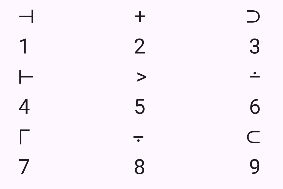

# SDMT - Symbol Digit Modalities Test

## What is the Symbol Digit Modalities Test (SDMT)?

The Symbol Digit Modalities Test (SDMT) is a standarized and widely used cognitive assesment, which primarily measures information processing speed but also involves other cognitive function. The test consists on a simple substitution task, based on a reference key like the one shown below:



During the test, a symbol appears in the middle of the screen. The user has to find that symbol in the reference key, and press the number corresponding to that symbol. Once the user selects a number, regardless if it is the correct one or not, a new symbol appears. This goes on until the time is consumed. The test measures the symbols displayed, number of errors, average time to select a number, and other metrics that help assess cognitive function.

This test is used for different applications, like measuring cognitive deterioration in patients with degenerative diseases such as multiple sclerosis, identifying early signs of dementia and Huntington's disease or differentiating brain-damaged from psychotic patients.

## Project Structure

The project follows a Feature-First directory organization:

```
lib/
|   +--- l10n/                      # Localization system used for multilenguage
|   |   +---generated/              # Dart code that manages multilenguage
|   |   +---app_en.arb              # ARB file with all the text used in the app in English
|   |   +---app_es.arb              # ARB file with all the text used in the app in Spanish
|   +---screens/                    # Contains one file for every screen 
|   |   +---countdownScreen.dart    
|   |   +---homeScreen.dart         
|   |   +---newProfileScreen.dart
|   |   +---resultsScreen.dart
|   |   +---splashScreen.dart
|   |   +---testScreen.dart
|   +---state_management/           # Contains files for managing the communication between different widgets in the app (state management)
|   |   +--locale_provider.dart     # Only for the multilenguage feature
|   |   +--providers.dart           # All the providers used for state management
|   +---utils/                      # Utilities
|   |   +--constants.dart           # Constants used to parametrize numeric values in the app
|   |   +--HomeButton.dart          # Class created for the buttons in the home screen
|   |   +--numberKey.dart           # Class created for the numeric keyboard in the test screen
|   |   +--testFunctions.dart       # Contains the functions that habdle the logic in the test screen
|   +---main.dart
```

Following the Feature-First structure, the code is organized by functionality (features) instead of by the type of file. 


## Getting Started

In order to launch the app, download the folder named SymbolsTest and execute the file named main.deterioration
